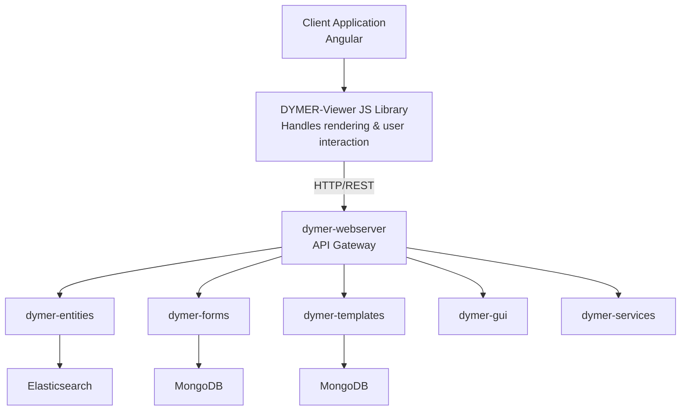

<a name="readme-top"></a>

[![Contributors][contributors-shield]][contributors-url]
[![Forks][forks-shield]][forks-url]
[![Stargazers][stars-shield]][stars-url]
[![Issues][issues-shield]][issues-url]


<!-- PROJECT LOGO -->
<br />
<div align="center">
  <a href="https://github.com/Engineering-Research-and-Development/DYMER">
    
  </a> 
</div>

 # DYMER - DYnamic Information ModElling & Rendering

[](https://github.com/Engineering-Research-and-Development/DYMER/releases/tag/v3.0.1)
[](LICENSE)
[](https://www.docker.com/)
[](https://nodejs.org/)
[](https://www.typescriptlang.org/)
[](docs/developers/04-contributing.md)

**DYMER** is a comprehensive suite for dynamic resource catalog visualization. It combines the power of a **Headless CMS** with a robust **template delivery engine**, enabling seamless mapping between JSON data models and graphic templates, with an out-of-the-box JavaScript viewer for web application integration.

## 🎯 Key Features

- **Dynamic Data Modeling** - Create and modify data schemas (JSON Schema) without writing code
- **Drag&Drop Modeling & Templating** - Create data model and template with drag&drop integrated builder
- **Logic-less Templates** - Generate graphic templates using Handlebars syntax
- **Powerful Search Engine** - Full-text search on textual, numerical, and geospatial data via Elasticsearch
- **RESTful API** - Clean, documented APIs for any frontend or backend integration
- **Ready-to-use JavaScript Viewer** - Drop-in library for instant entity rendering
- **Microservices Architecture** - Scalable, containerized services orchestrated with Docker
- **Admin GUI** - Modern TypeScript-based administration interface
- **Multi-tenant Ready** - Support for multiple models, templates, and entity types

## 🏗️ Architecture Overview

DYMER consists of six microservices, each running in its own Docker container:

Client Application (React, Vue, Angular, or Vanilla JS)
-DYMER-Viewer (JS Library)
-dymer-webserver (API Gateway)
-Individual services: dymer-entities, dymer-forms, dymer-templates, dymer-gui, dymer-services
-Databases: Elasticsearch and MongoDB




### Component Breakdown

| Service | Purpose | Port (default) | Technology |
|---------|---------|----------------|-------------|
| `dymer-webserver` | API Gateway & routing | 8080 | Node.js + Express |
| `dymer-entities` | Entity CRUD + search | 1358 | Node.js + Elasticsearch |
| `dymer-forms` | Data model management | 4747 | Node.js + MongoDB |
| `dymer-templates` | Template storage & rendering | 4545 | Node.js + Handlebars |
| `dymer-gui` | Admin interface | 4200 | TypeScript + Modern Framework |
| `dymer-services` | Auxiliary services | 5050 | Node.js |
| `mongodb` | Db store for settings   | 27017 |   |
| `elasticsearch` | Index store   | 9200/9300 |   |
| `Ollama` | AI code agent  | 7869 |   |

## 🚀 Quick Start

### Prerequisites

- Docker (version >= 20.10)
- Docker Compose (version >= 2.0)
- Git

### Installation

```bash
# Clone the repository
git clone https://github.com/Engineering-Research-and-Development/DYMER.git
cd DYMER

# Configure port (optional)
echo "HOST_PORT=8080" > .env

# Start all services
docker-compose up -d

# Wait for services to be ready (approx. 30 seconds)
docker-compose ps
```


## First Access
Open your browser and navigate to: http://localhost:8080 (or your configured port)

Login with default credentials:

*Username: admin
*Password: dymer

Change your password immediately after first login
 
## Verify Installation
```bash
# Check if all services are running
docker-compose ps

# Test the API
curl http://localhost:8080/api/v1/health

# Expected response:
{"status":"ok","version":"3.0.1"}
```


# Check if all services are running
docker-compose ps

# Test the API
curl http://localhost:8080/api/v1/health

# Expected response:
{"status":"ok","version":"3.0.1"}
  
 
<p align="right">(<a href="#readme-top">back to top</a>)</p>


## Technologies

| Description                                     | Language    | Version          |
| :---------------------------------------------- | :---------: | :--------------: |
| [Node.js][1]                                    | JavaScript  | 20.19.6         |
| [Express][2]                                    | JavaScript  | 4.16.4           |
| [Docker][3]                                     |             | 19.03.8          |
| [AngularJS][4]                                  | JavaScript  | 20          |
| [JQuery][5]                                     |             | 3.7              |
| [Bootstrap][6]                                  |             | 4/5              |
| [Handlebars][7]                                 |             |                  |
| [MongoDB][8]                                    |             | 7.0.4          |
| [ElasticSearch][9]                              |             | 8.11           |


[1]:  https://nodejs.org/en/
[2]:  https://expressjs.com/en/4x/api.html
[3]:  https://docs.docker.com/get-docker/
[4]:  https://angularjs.org/
[5]:  https://jquery.com/
[6]:  https://getbootstrap.com/
[7]:  https://handlebarsjs.com/
[8]:  https://www.mongodb.com/try/download/community
[9]:  https://www.elastic.co/


# DYMER - Documentation

## Quick Links

| Type | Guide |
|------|-------|
| 👥 **User Guide** | [Getting Started](docs/users/01-getting-started.md) → |
| 👨‍💻 **Developer Guide** | [API Reference](docs/developers/02-api-reference.md) → |
| ❓ **Help** | [FAQ](docs/users/07-faq.md) → |

---

## User Documentation

Start here if you want to use DYMER to manage and display content:

### 📖 Core Guides

| # | Guide | What you'll learn |
|---|-------|-------------------|
| 1 | [Getting Started](docs/users/01-getting-started.md) | First login, basic concepts |
| 2 | [Admin Guide](docs/users/02-admin-guide.md) | Admin panel features |
| 3 | [Model Definition](docs/users/03-model-definition.md) | Create data structures |
| 4 | [Template Creation](docs/users/04-template-creation.md) | Design visual layouts |
| 5 | [Entity Management](docs/users/05-entity-management.md) | Add and edit content |
| 6 | [Viewer Integration](docs/users/06-viewer-integration.md) | Show content on your website |
| 7 | [FAQ](docs/users/07-faq.md) | Common questions solved |


## 🐛 Troubleshooting

### Table of Contents

| Issue                                           | Solution  							  |
| :---------------------------------------------- | :---------:							  |
| [Port already in use]                           | Change HOST_PORT in .env file         |  
| [Services not starting]                         | Run docker-compose logs to see errors |  
| [Cannot connect to database]                    | Ensure MongoDB/Elasticsearch containers are healthy: docker-compose ps |  

 

## Contributors

* 
* 

### Top contributors:

<a href="https://github.com/Engineering-Research-and-Development/DYMER/graphs/contributors">
  
</a>

<p align="right">(<a href="#readme-top">back to top</a>)</p>


## Status
Project is: _in progress_ 


## License


[contributors-shield]: https://img.shields.io/github/contributors/Engineering-Research-and-Development/DYMER.svg?style=for-the-badge
[contributors-url]: https://github.com/Engineering-Research-and-Development/DYMER/graphs/contributors
[forks-shield]: https://img.shields.io/github/forks/Engineering-Research-and-Development/DYMER.svg?style=for-the-badge
[forks-url]: https://github.com/Engineering-Research-and-Development/DYMER/network/members
[stars-shield]: https://img.shields.io/github/stars/Engineering-Research-and-Development/DYMER.svg?style=for-the-badge
[stars-url]: https://github.com/Engineering-Research-and-Development/DYMER/stargazers
[issues-shield]: https://img.shields.io/github/issues/Engineering-Research-and-Development/DYMER.svg?style=for-the-badge
[issues-url]: https://github.com/Engineering-Research-and-Development/DYMER/issues
